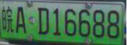

# tinkoff-dl-advanced-test

Вступительное задание на курс DL Advanced.

Системы распознавания автомобильных номеров состоят из двух модулей: детекция и распознавание символов (Optical Character Recognition, OCR). Детектор выделяет прямоугольник с номером из изображения, а OCR конвертирует его в текст. Будем считать, что детектор уже реализован. В рамках вступительного экзамена предлагается самостоятельно обучить модель OCR для автомобильных номеров.

**Пример входа:**

**Пример выхода:**  皖AD16688
